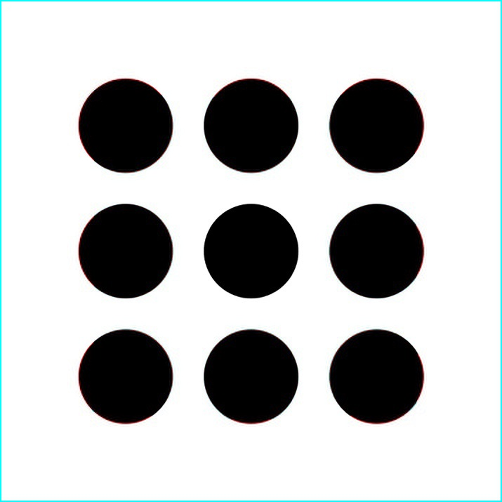

# Aberration

Удаление хроматических аберраций с изображений

## Требования к сборке

* C++ 98

* OpenCV 3.4.1

* GNU GSL

## Структура проекта

В папке `sources` находятся исходники для сборки программ для удаления аберрации с изображений.

В папке `docs` находятся статьи, на основании которых была разработана данная система.  
Система уравнений, из которой находятся коэффициенты аппроксимирующей функции, находится в файле "formulas.docx"

## Результаты работы программы

До:  

После:  

